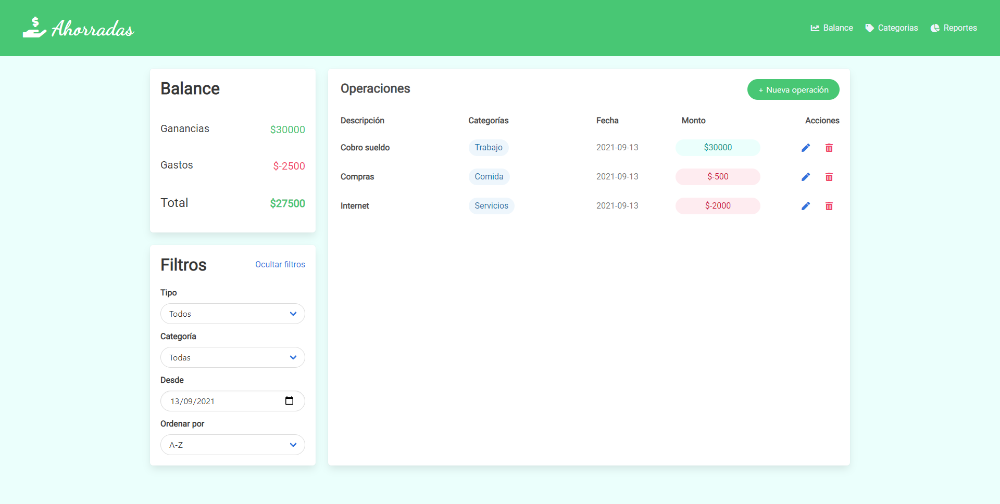

# 💰 Ahorradas

### Con esta app puedes mantener un registro de tus gastos y ganancias que te permita organizar tu economía y ahorrar. Además, se generará automaticamente un balance y un reporte de todos tus movimientos.
### El proyecto fue realizado de manera grupal como evaluación del quinto modulo del cursado de desarrollo Frontend de Ada ITW.

### Para probar la aplicación, puedes acceder al siguiente [enlace](https://milenagimenez.github.io/ahorradas/).
 

***

### ➡ Este proyecto fue realizado con:
- HTML
- CSS
- Javascript
- Bulma Framework CSS
 

***
## ➡ Este proyecto utiliza las siguientes dependencias:
-  [Bulma](https://bulma.io/documentation/elements/)
-  [Font Awesome](https://fontawesome.com/icons)
-  [Google Fonts](https://fonts.google.com/)